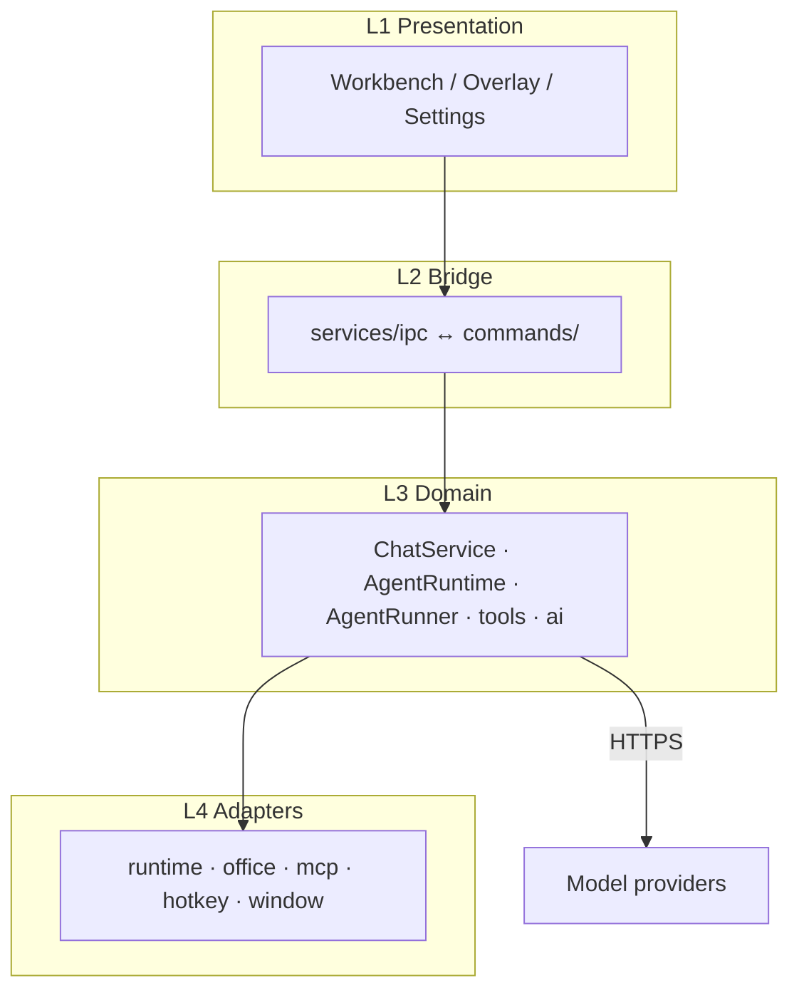

# AAAi

<p align="center">
  
</p>

<h2 align="center">An AI chat and coding assistant, available anywhere on Windows</h2>

<p align="center">
  Double-tap <kbd>Alt</kbd> for a floating overlay anywhere on your desktop.
  When a chat needs more room, open it in the workbench with one click.
</p>

<p align="center">
  <a href="./README.md">English</a> ·
  <a href="./README.zh-CN.md">简体中文</a>
</p>

<p align="center">
  
  
  
</p>

## Overlay — ask from anywhere

Double-tap <kbd>Alt</kbd> in any app to show or hide the floating window. Ask a
question, follow up in place, and keep Agent / model / approval controls under
the composer.

<p align="center">
  
</p>

AAAi tries to pick up the current text selection or Explorer selection. You can
also paste or drag images and files into the input.

<p align="center">
  
</p>

<p align="center">
  
</p>

Summoning outside an IDE starts a **temporary Quick Ask** session — it is not
bound to a workspace, so history does not land in a stale project. Bind a
workspace only when you choose one in the overlay (or with `/work`), or when you
trigger from an IDE that is actually in the foreground.

While a conversation is running, use **Open conversation in workbench** (the
window icon on the overlay) to move that same session into the full desktop UI
in one click — progress, tools, and history continue there.

### IDE context plugins

Install the companion plugin so VS Code or IntelliJ can push active file,
workspace, language, and selection to the local AAAi app (best-effort; the
editor keeps working if AAAi is not running).

- [Visual Studio Code](https://marketplace.visualstudio.com/items?itemName=AAAi.aaai-ide-context)
- [IntelliJ Platform](https://plugins.jetbrains.com/plugin/33163-aaai-ide-context)

## Workbench — manage every session

The workbench is the full desktop surface. Temporary Quick Ask chats from the
overlay appear here alongside pinned threads and project workspaces, so you can
talk, switch, and organize them in one place.

<p align="center">
  
</p>

- **Pinned** — keep important threads at the top.
- **Workspaces** — bind chats to a project folder so Agent edits stay in context.
- **Quick Ask** — the same temporary sessions started from the overlay; continue
  them here, start new ones, or keep a long-running chat in the workbench while
  you still summon the overlay elsewhere.

### Review changes

When Agent edits files, AAAi shows a per-file summary and a focused Diff view so
you can inspect every addition and deletion before you move on.

<p align="center">
  
</p>

- Task list and verification stay on the conversation timeline.
- Open **Review** to browse side-by-side or unified diffs.
- Undo is available for changes AAAi applied in the current session.

### Settings

Configure models, providers, agent behavior, and extensions from the embedded
settings page — theme, memory, search, MCP, Skills, and more.

<p align="center">
  
</p>

Highlights:

- Default chat model and optional vision / multimodal fallback.
- Split multimodal analysis when the primary model cannot see images.
- Reasoning effort, reasoning language, and whether to show the thinking process.
- Tool approval mode (for example Always allow) and Agent work display density.

## Ask and Agent

- **Ask** — read-only tools (files, search, LSP, configured read-only tools). No file writes, Shell, or Git.
- **Agent** — default mode; can read and edit files, run PowerShell, and use Git, Skills, MCP, and sub-agents. Approval policy is controlled in Settings.

### More capabilities

- **Microsoft Office** — when Word, Excel, or PowerPoint is running, AAAi can collect document context and use `word_*` / `excel_*` / `ppt_*` tools.
- **Pinned-image badge** — optional PixPin / Snipaste badge to open a chat with that image attached.
- **Sub-agents** — split larger work across child agents while progress stays visible in the main thread.

### Model providers

- DeepSeek with an API key.
- Gemini through Google sign-in (Antigravity OAuth).
- Custom OpenAI-compatible providers (Base URL, API key, model list).

For image input with a text-only primary model, set a vision model or enable multimodal split analysis in Settings.

### Optional services

- Web search — Serper or Tavily API key.
- MCP servers, LSP, local memory, and optional mem0 cloud sync.

The composer shows context usage; you can pick model and thinking level while tools run.

## Install and get started

1. Download and install the MSI from [Releases](../../releases).
2. Open **Settings** from the AAAi tray icon and configure a model provider.
3. Double-tap <kbd>Alt</kbd>, type a question, press <kbd>Enter</kbd> — or open the session in the workbench when you need the full UI.

| Shortcut                                            | Action                                          |
| --------------------------------------------------- | ----------------------------------------------- |
| Double-tap <kbd>Alt</kbd>                           | Show or hide the overlay                        |
| <kbd>Ctrl</kbd> + <kbd>Alt</kbd> + <kbd>Space</kbd> | Fallback summon shortcut                        |
| <kbd>Enter</kbd>                                    | Send a message                                  |
| <kbd>/</kbd>                                        | Slash commands                                  |
| <kbd>Esc</kbd>                                      | Clear input; closes the window in some contexts |

## Data and privacy

API keys, OAuth tokens, settings, and chat history stay on your machine by
default. Context capture is local; the message and attached context leave the
device only when you send them to your configured provider.

Enabling web search, MCP, or mem0 cloud sync also sends data to those services —
enable them only if you accept their policies.

## Technical architecture

AAAi is a single-process **Tauri 2** application: WebView2 surfaces (Vue 3 + Pinia)
for presentation, and a Rust host for OS integration, chat domain logic, model I/O,
and tool execution.

Architecture views (context, layers, control flow, agent orchestration):
[English](./docs/architecture-overview.md) ·
[简体中文](./docs/architecture-overview.zh-CN.md).



Primary chat path:

```text
invoke("chat")
  → ChatService::send
  → StreamManager / AgentRuntime
  → AgentRunner::run  (agent_loop policies)
  → AIProvider::stream + ToolRegistry
  → EventBus → chat-* / tool-* events → Pinia
```

`AgentRunner` owns the model↔tools loop. `AgentRuntime` owns run lifecycle
(cancel, soft-inject, debug). Do not add a second chat loop beside `AgentRunner`.

## Run from source

Requires Node.js 18+, pnpm, Rust stable, VS C++ Build Tools, and WebView2.

```bash
pnpm install
pnpm tauri:dev
```

```bash
pnpm check   # typecheck + lint + test
pnpm tauri:build
```

The installer is written to `src-tauri/target/release/bundle/msi/` as
`AAAi_0.2.0_x64.msi` (no `_en-US` suffix).

For releases and in-app updates (`latest.json`, signing, GitHub Releases), see
[Releases and remote updates](./docs/release.md) · [简体中文](./docs/release.zh-CN.md).

## License

This repository is dedicated to the public domain under the [Unlicense](./LICENSE).
