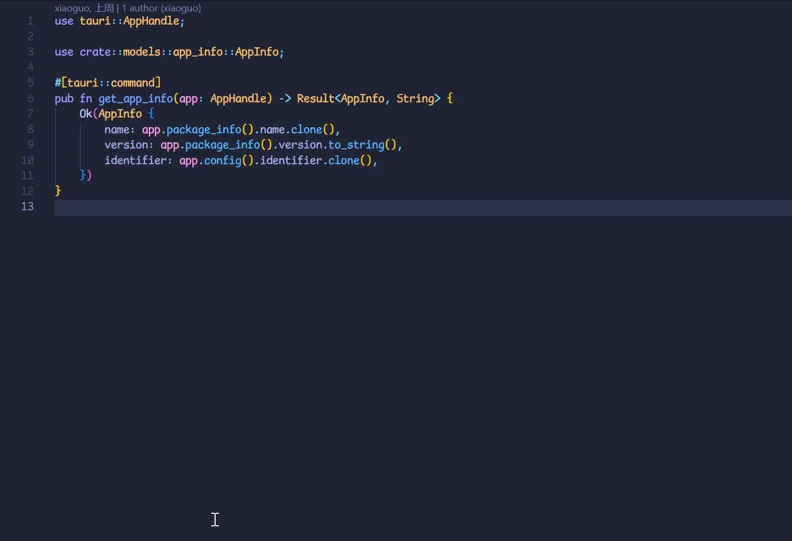
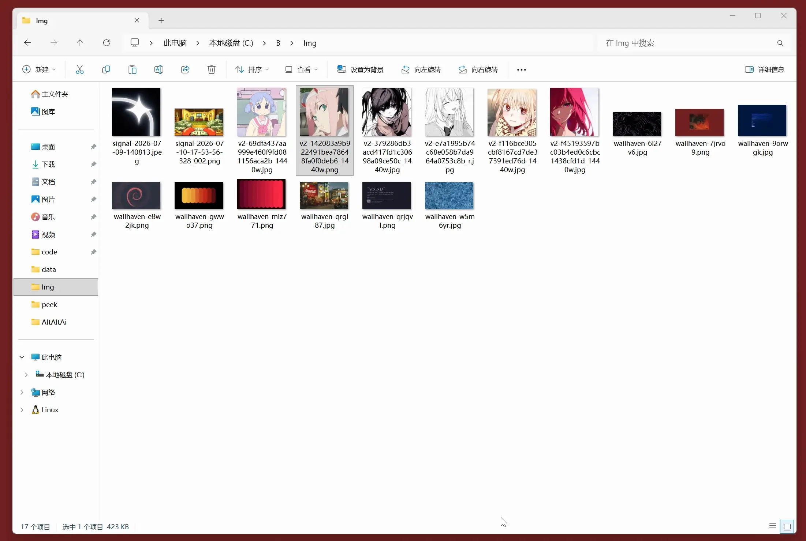
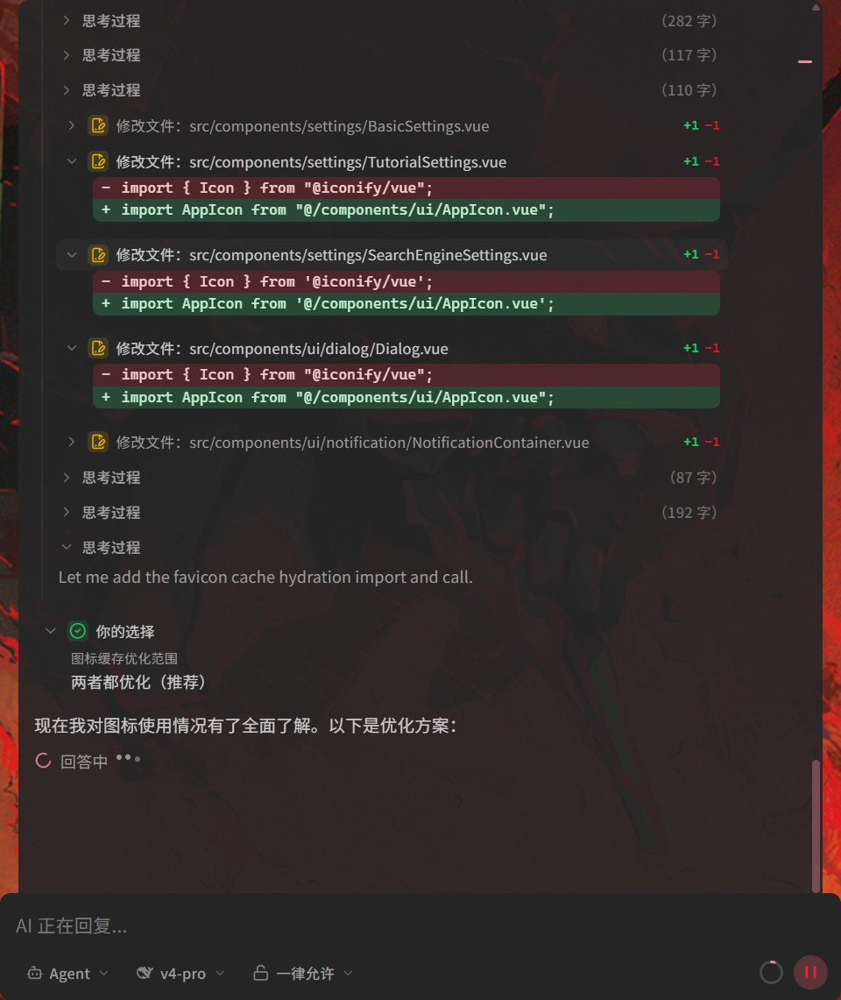

# AAAi

<p align="center">
  
</p>

<h2 align="center">在 Windows 上随时唤出的 AI 对话与编码助手</h2>

<p align="center">
  双击 <kbd>Alt</kbd>，将当前文本选区、资源管理器选中文件，或手动附加的图片和文件带入对话。
</p>

<p align="center">
  <a href="./README.md">English</a> ·
  <a href="./README.zh-CN.md">简体中文</a>
</p>

<p align="center">
  
  
  
</p>

## 上下文与附件

唤出时，AAAi 会尝试读取当前应用中的文本选区，或资源管理器中选中的文件。图片、文本和文本文件也可直接在输入框中粘贴或拖拽附加。

<p align="center">
  
</p>

<p align="center">
  
</p>

工作区不会自动识别；请通过设置或 `/work` 手动选择。未选中的剪贴板文本和活动窗口标题不会自动加入消息。

### IDE 上下文插件

在 VS Code 或 IntelliJ 系列 IDE 中安装上下文插件后，AAAi 便能理解你正在处理的代码。只需选中一段有意义的内容，插件就会在本机把相关文件、项目目录、编程语言、所选代码及其位置交给 AAAi，为接下来的提问补足必要背景。即使 AAAi 尚未启动，插件也不会打断手头的编辑工作。

- [安装 Visual Studio Code 扩展](https://marketplace.visualstudio.com/items?itemName=AAAi.aaai-ide-context)
- [安装 IntelliJ Platform 插件](https://plugins.jetbrains.com/plugin/33163-aaai-ide-context)

## 使用方式

### 一按即达

在任何应用中双击 <kbd>Alt</kbd>，即可显示或隐藏悬浮窗口。默认备用快捷键是 <kbd>Ctrl</kbd> + <kbd>Alt</kbd> + <kbd>Space</kbd>，可在设置中修改。

### Ask 与 Agent

- **Ask**：可使用读文件、搜索、LSP 和已配置的只读工具，但不能修改文件、执行 Shell 命令或运行 Git 操作。
- **Agent**：默认模式；可读写文件、执行 PowerShell、使用 Git、Skills、MCP 和子 Agent。工具审批行为由设置决定。

<p align="center">
  
</p>

### 顺手的辅助

- **贴图辅助**：可在 PixPin 或 Snipaste 的贴图上启用 AAAi 角标，点击后便能带着这张图片开始提问。
- **文件 Diff**：Agent 修改代码后，可按文件查看增删内容，让每一处变化都有迹可循。
- **子 Agent**：面对较复杂的任务，Agent 可以把彼此独立的部分交给子 Agent 协作处理，进度与工具操作仍集中呈现在主对话中。

### 模型服务商

- DeepSeek：使用 API Key。
- Gemini：使用 Google 账号登录 Antigravity OAuth。
- 自定义服务商：填写 OpenAI 兼容接口的 Base URL、API Key 与模型列表。

主模型不支持图片时，需要在设置中配置视觉模型，或启用多模态分拆分析。

### 可选能力

- 网页搜索：需在设置中启用并配置 Serper 或 Tavily API Key。
- MCP：需在设置中添加 MCP Server。
- LSP：需在设置中启用。
- 跨会话记忆：可使用本地记忆；启用 mem0 云同步时会访问对应服务。

输入栏会显示上下文用量；你也可以选择模型与思考档位，并在对话中查看工具执行过程。

## 安装与开始使用

1. 从 [Releases](../../releases) 下载并安装 MSI。
2. 点击系统托盘中的 AAAi 图标，打开 **设置**，配置模型服务商。
3. 回到任意应用，双击 <kbd>Alt</kbd>，输入问题后按 <kbd>Enter</kbd>。

| 快捷键                                              | 作用                         |
| --------------------------------------------------- | ---------------------------- |
| 双击 <kbd>Alt</kbd>                                 | 显示或隐藏悬浮窗口           |
| <kbd>Ctrl</kbd> + <kbd>Alt</kbd> + <kbd>Space</kbd> | 备用唤出快捷键               |
| <kbd>Enter</kbd>                                    | 发送消息                     |
| <kbd>/</kbd>                                        | 打开斜杠命令                 |
| <kbd>Esc</kbd>                                      | 清空输入；部分场景下关闭窗口 |

## 数据与隐私

API Key、OAuth 令牌、设置和聊天记录默认保存在本机。选区和文件采集也在本地完成；只有发送消息后，消息及其附带上下文才会发往你配置的模型服务商。

启用网页搜索、MCP 或 mem0 云同步时，相关内容还会发送给对应的第三方服务。请根据所用服务的隐私政策决定是否启用。

## 从源码运行

需要 Node.js 18+、pnpm、Rust stable、VS C++ Build Tools 与 WebView2。

```bash
pnpm install
pnpm tauri dev
```

前端工程化说明见 [docs/frontend-architecture.md](./docs/frontend-architecture.md)；Rust 后端见 [docs/rust-architecture.md](./docs/rust-architecture.md)。日常门禁：

```bash
pnpm check   # typecheck + lint + test
```

构建 MSI：

```bash
pnpm tauri:build
```

安装包输出至 `src-tauri/target/release/bundle/msi/`。
生成的文件名为 `AAAi_0.1.4_x64.msi`，不再带有 `_en-US` 后缀。

本项目采用 [Unlicense](./LICENSE)，相当于公共领域，几乎无限制使用、修改与分发。
