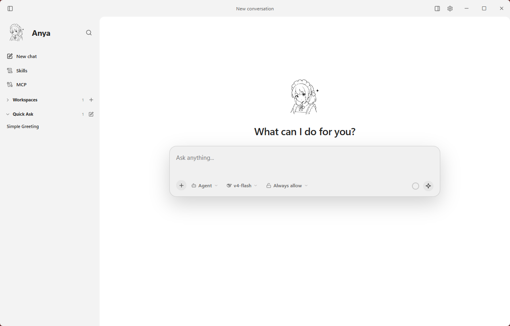
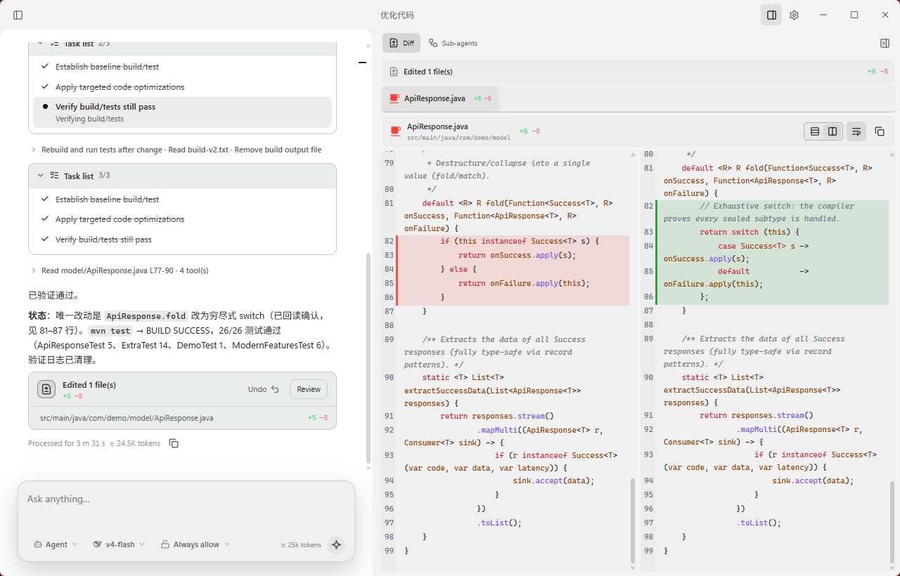
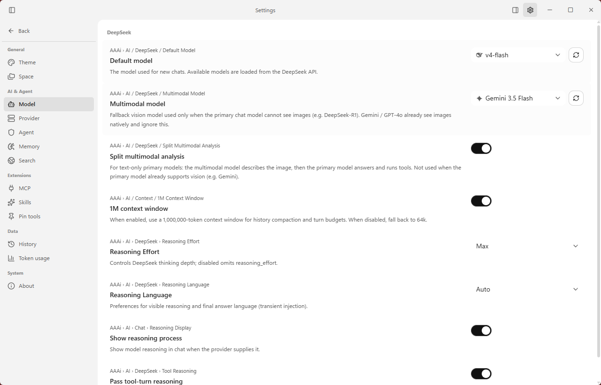
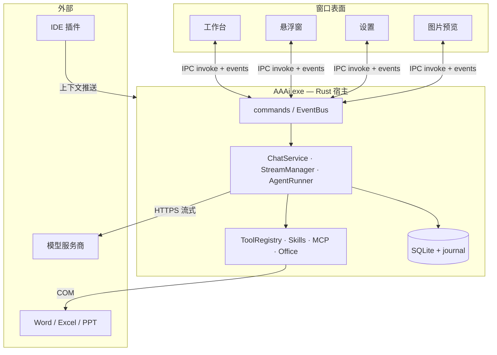

# AAAi

<p align="center">
  
</p>

<h2 align="center">在 Windows 上随时唤出的 AI 对话与编码助手</h2>

<p align="center">
  双击 <kbd>Alt</kbd>，在任意应用中唤出悬浮窗。
  需要更大空间时，可一键把当前会话转到工作台继续。
</p>

<p align="center">
  <a href="./README.md">English</a> ·
  <a href="./README.zh-CN.md">简体中文</a>
</p>

<p align="center">
  
  
  
  
</p>

## 文档

| 文档                                                  | 说明                                          |
| ----------------------------------------------------- | --------------------------------------------- |
| [技术架构总览](./docs/architecture-overview.zh-CN.md) | 分层、控制流、Agent 循环、持久化、事件契约    |
| [维护手册](./docs/maintenance.zh-CN.md)               | 本地环境、调试、测试、发布卫生、约定          |
| [发布与远程更新](./docs/release.zh-CN.md)             | MSI 签名、`latest.json`、GitHub Releases / CI |
| [文档索引](./docs/README.zh-CN.md)                    | 完整文档地图                                  |

English docs: [README.md](./README.md) · [Architecture](./docs/architecture-overview.md) · [Maintenance](./docs/maintenance.md) · [Release](./docs/release.md)

---

## 悬浮窗 — 随时提问

在任意应用中双击 <kbd>Alt</kbd> 即可显示或隐藏悬浮窗。直接提问、追问，并在输入栏下方切换 Agent / 模型 / 审批策略。

<p align="center">
  
</p>

AAAi 会尝试读取当前文本选区或资源管理器选中项；也可将图片与文件粘贴 / 拖入输入框。

<p align="center">
  
</p>

<p align="center">
  
</p>

在 IDE 外唤出时，会话会作为**临时快速提问**，不会绑定工作区，避免写入旧项目。
只有你在浮窗中主动选择工作区（或使用 `/work`），或在真正处于前台的 IDE 里触发时，才会绑定项目。

对话进行中，点击悬浮窗上的 **在工作区中打开对话**（窗口图标），即可一键把同一会话转到工作台——进度、工具调用与历史都会在那里继续。

### IDE 上下文插件

安装配套插件后，VS Code / IntelliJ 可将当前文件、工作区、语言与选区推送到本机 AAAi（尽力而为；AAAi 未运行时不影响编辑器）。

- [Visual Studio Code](https://marketplace.visualstudio.com/items?itemName=AAAi.aaai-ide-context)
- [IntelliJ Platform](https://plugins.jetbrains.com/plugin/33163-aaai-ide-context)

---

## 工作台 — 统一管理会话

工作台是完整的桌面界面。悬浮窗里的临时快速提问会出现在这里，与置顶会话、项目工作区放在一起，方便同时沟通与切换管理。

<p align="center">
  
</p>

- **置顶** — 重要会话固定在上方。
- **工作区** — 将会话绑定到项目目录，便于 Agent 在正确上下文中改代码。
- **快速提问** — 与悬浮窗发起的临时会话是同一批记录；可在此继续聊、新建，或把正在进行的长对话留在工作台处理，同时仍可在别处唤出浮窗。

### 审查变更

Agent 修改文件后，AAAi 会给出按文件汇总，并提供 Diff 视图，方便逐处核对增删。

<p align="center">
  
</p>

- 任务列表与验证结果仍留在对话时间线中。
- 点击 **审查** 可查看并排或统一 Diff。
- 当前会话内由 AAAi 应用的变更支持撤销（检查点）。

### 设置

在内嵌设置页配置模型、服务商、Agent 行为与扩展：主题、记忆、搜索、MCP、Skills 等。

<p align="center">
  
</p>

常用项：

- 默认对话模型，以及可选的视觉 / 多模态回退模型。
- 主模型不支持图片时，可启用多模态分拆分析。
- 思考力度、思考语言，以及是否展示思考过程。
- 工具审批模式（如始终允许）与 Agent 过程详情的展示密度。
- 大上下文窗口开关（约 100 万 vs 64k，影响压缩与单轮预算）。

---

## 能力一览

### Ask 与 Agent

| 模式      | 意图                       | 典型工具                                     |
| --------- | -------------------------- | -------------------------------------------- |
| **Ask**   | 只读调研                   | 读文件、搜索、LSP、已配置的只读工具          |
| **Agent** | 默认；在可控前提下改动环境 | 文件、PowerShell、Git、Skills、MCP、子 Agent |

Ask 不开放写文件 / Shell / Git；Agent 在设置中的审批策略下开放。两种模式共用同一套 `AgentRunner` 循环——约束落在工具 Schema 暴露与审批门禁，而不是第二套编排器。

### 时间线与工具卡片

助手回合按发生顺序交错展示 **思考**、**回复正文** 与 **工具活动**（实时流式与持久化历史均如此）。长思考不再把中途执行的命令与改动挤到看不见的位置。

### 集成

- **Microsoft Office** — Word / Excel / PowerPoint 运行时，可采集文档上下文，并使用 `word_*` / `excel_*` / `ppt_*` 工具（COM）。
- **Skills** — 内置与厂商技能（docx、pandoc、research、review、技术标等）以 playbook 形式加载，可按子 Agent 执行。
- **MCP** — 连接 stdio / 远程 MCP 服务（含 Smithery 相关辅助）。
- **LSP** — 配置后可提供语言服务诊断。
- **贴图角标** — 可选为 PixPin / Snipaste 贴图启用 AAAi 角标，带着图片开聊。
- **子 Agent** — 复杂任务可拆给子 Agent，进度仍汇总在主对话中。
- **记忆** — 本地记忆工具；可选 mem0 云同步。
- **网页搜索** — 配置 Serper 或 Tavily API Key 后可用。

### 模型服务商

- **DeepSeek** — API Key。
- **Gemini** — Google 账号登录（Antigravity OAuth）。
- **自定义** — OpenAI 兼容接口的 Base URL、API Key 与模型列表。

主模型不支持图片时，请配置视觉模型或启用多模态分拆分析。

输入栏会显示会话级 token 估算与上下文用量；可切换模型与思考档位，并查看工具执行过程。

---

## 安装与开始使用

1. 从 [Releases](../../releases) 下载并安装 MSI。
2. 从系统托盘打开 **设置**，配置模型服务商。
3. 双击 <kbd>Alt</kbd> 提问；需要完整界面时，一键转到工作台继续。

| 快捷键                                              | 作用                         |
| --------------------------------------------------- | ---------------------------- |
| 双击 <kbd>Alt</kbd>                                 | 显示或隐藏悬浮窗             |
| <kbd>Ctrl</kbd> + <kbd>Alt</kbd> + <kbd>Space</kbd> | 备用唤出快捷键               |
| <kbd>Enter</kbd>                                    | 发送消息                     |
| <kbd>/</kbd>                                        | 斜杠命令                     |
| <kbd>Esc</kbd>                                      | 清空输入；部分场景下关闭窗口 |

---

## 数据与隐私

API Key、OAuth 令牌、设置与聊天记录默认保存在本机。选区与文件采集也在本地完成；只有发送消息后，消息及其附带上下文才会发往你配置的模型服务商。

启用网页搜索、MCP 或 mem0 云同步时，相关内容还会发给对应第三方服务，请按其隐私政策决定是否开启。

崩溃恢复使用本地 SQLite journal：下次启动会结算中断的流式回合，避免界面卡在「执行中」。

---

## 技术架构（摘要）

AAAi 为单进程 **Tauri 2** 应用：WebView2（Vue 3 + Pinia）负责呈现；Rust 宿主负责
OS 集成、聊天领域逻辑、模型 I/O 与工具执行。



主路径：

```text
invoke("chat")
  → ChatService::send
  → StreamManager / AgentRuntime
  → AgentRunner::run  (agent_loop 策略)
  → AIProvider::stream + ToolRegistry
  → EventBus → chat-* / tool-* → Pinia
  → ConversationManager 持久化消息（含 work_timeline）
```

`AgentRunner` 负责 model↔tools 主循环；`AgentRuntime` 负责 run 生命周期（取消、
soft-inject、debug）。不要在 `AgentRunner` 之外平行再造一套对话循环。

完整视图：[技术架构总览](./docs/architecture-overview.zh-CN.md)。

维护流程：[维护手册](./docs/maintenance.zh-CN.md)。

---

## 从源码运行

需要 Node.js 18+、pnpm、Rust stable、VS C++ Build Tools 与 WebView2。

```bash
pnpm install
pnpm tauri:dev
```

```bash
pnpm check          # typecheck + lint + 前端测试
cd src-tauri && cargo test --lib
pnpm tauri:build
```

安装包输出至 `src-tauri/target/release/bundle/msi/`，文件名为 `AAAi_0.2.1_x64.msi`（无 `_en-US` 后缀）。

发布与应用内更新见 [发布与远程更新](./docs/release.zh-CN.md) · [English](./docs/release.md)。

---

## 许可证

本项目采用 [Unlicense](./LICENSE)，相当于公共领域，几乎无限制使用、修改与分发。
