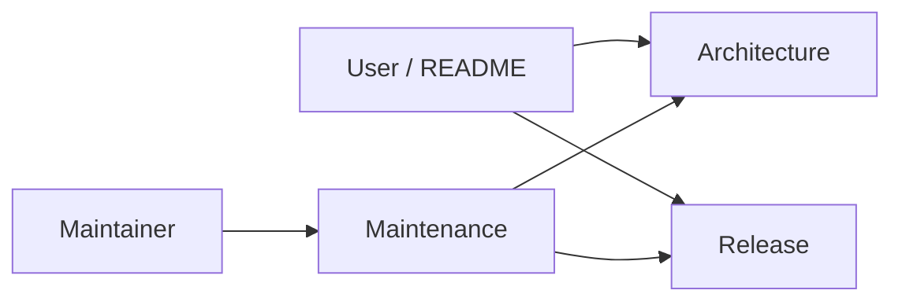

# Anya documentation

  <a href="./README.md">English</a> ·
  <a href="./README.zh-CN.md">简体中文</a>

Product home: [../README.md](../README.md)

| Document                                            | Audience         | Contents                                                                              |
| --------------------------------------------------- | ---------------- | ------------------------------------------------------------------------------------- |
| [Architecture overview](./architecture-overview.md) | Contributors     | Layers, process topology, agent loop, timeline, persistence, events, extension points |
| [Maintenance guide](./maintenance.md)               | Maintainers      | Env setup, workflows, debugging, tests, version bump, conventions                     |
| [Releases & remote updates](./release.md)           | Release managers | Signing, `latest.json`, GitHub Releases, CI                                           |
| Screenshots                                         | Users / README   | `image/` assets referenced from the root README                                       |

When changing behavior, update the matching row above and keep the Chinese twin
in sync (`*.zh-CN.md`).
