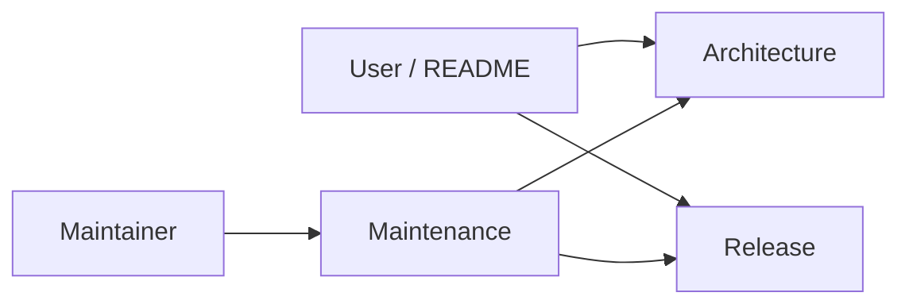

# Anya documentation

  <a href="./README.md">English</a>
  &nbsp;·&nbsp;
  <a href="./README.zh-CN.md">简体中文</a>

Product home: [../README.md](../README.md)

These pages are the maintainer map — start at the root README for the product story, then open the guide that matches your task.

| Document                                            | Audience         | When to open it                                                     |
| --------------------------------------------------- | ---------------- | ------------------------------------------------------------------- |
| [Architecture overview](./architecture-overview.md) | Contributors     | Layers, process topology, agent loop, timeline, persistence, events |
| [Maintenance guide](./maintenance.md)               | Maintainers      | Environment, debug, tests, version bumps, conventions               |
| [Releases & remote updates](./release.md)           | Release managers | Signing, `latest.json`, GitHub Releases, CI                         |
| Screenshots (`image/`)                              | Users / README   | Assets linked from the root README                                  |

When behavior changes, update the matching document and keep its Chinese twin (`*.zh-CN.md`) in sync.
