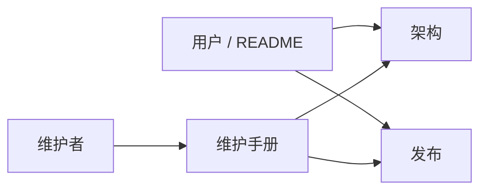

# Anya 文档索引

  <a href="./README.md">English</a>
  &nbsp;·&nbsp;
  <a href="./README.zh-CN.md">简体中文</a>

产品主页：[../README.zh-CN.md](../README.zh-CN.md)

这里是维护者文档地图——产品介绍请看根目录 README；按任务打开对应指南即可。

| 文档                                             | 读者          | 适用场景                                         |
| ------------------------------------------------ | ------------- | ------------------------------------------------ |
| [技术架构总览](./architecture-overview.zh-CN.md) | 贡献者        | 分层、进程拓扑、Agent 循环、时间线、持久化、事件 |
| [维护手册](./maintenance.zh-CN.md)               | 维护者        | 环境、调试、测试、版本提升、约定                 |
| [发布与远程更新](./release.zh-CN.md)             | 发版负责人    | 签名、`latest.json`、GitHub Releases、CI         |
| 截图资源（`image/`）                             | 用户 / README | 根目录 README 引用的截图                         |

行为变更时，请更新上表对应文档，并保持中英文姊妹篇（`*.zh-CN.md`）结构同步。
