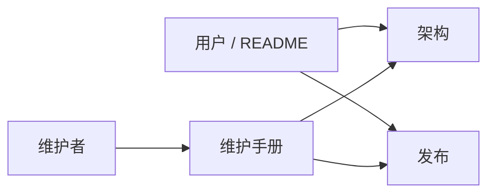

# AAAi 文档索引

  <a href="./README.md">English</a> ·
  <a href="./README.zh-CN.md">简体中文</a>

产品主页：[../README.zh-CN.md](../README.zh-CN.md)

| 文档                                             | 读者          | 内容                                                     |
| ------------------------------------------------ | ------------- | -------------------------------------------------------- |
| [技术架构总览](./architecture-overview.zh-CN.md) | 贡献者        | 分层、进程拓扑、Agent 循环、时间线、持久化、事件、扩展点 |
| [维护手册](./maintenance.zh-CN.md)               | 维护者        | 环境、日常流程、调试、测试、版本提升、约定               |
| [发布与远程更新](./release.zh-CN.md)             | 发版负责人    | 签名、`latest.json`、GitHub Releases、CI                 |
| 截图资源                                         | 用户 / README | `image/`，由根目录 README 引用                           |

行为变更时更新上表对应文档，并保持中英文姊妹篇（`*.zh-CN.md`）结构同步。
