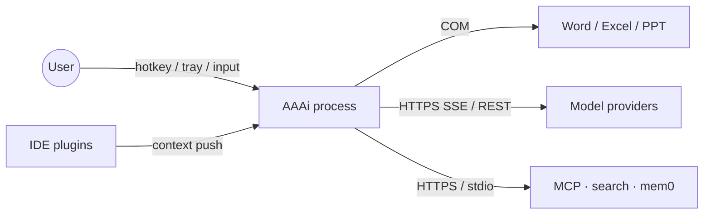
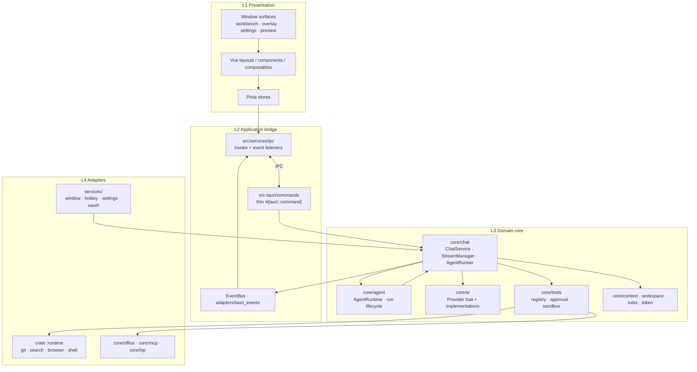
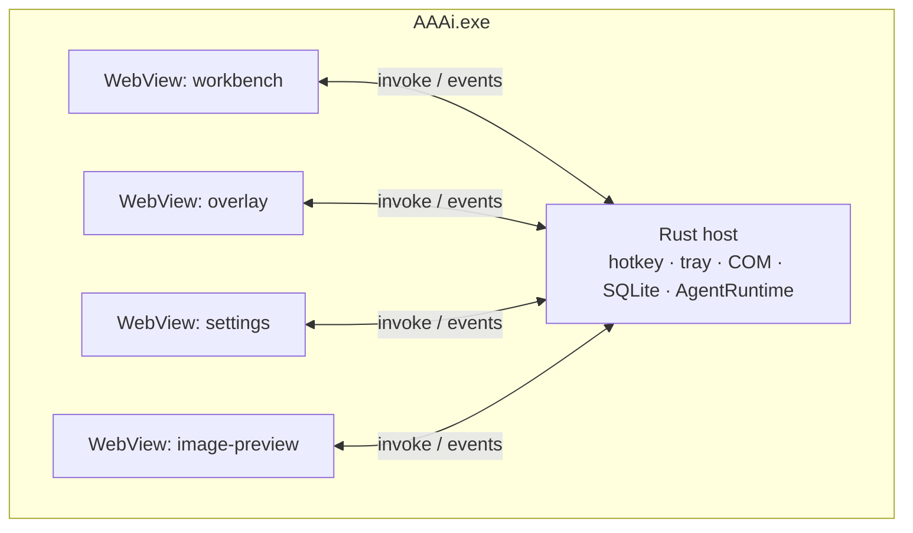
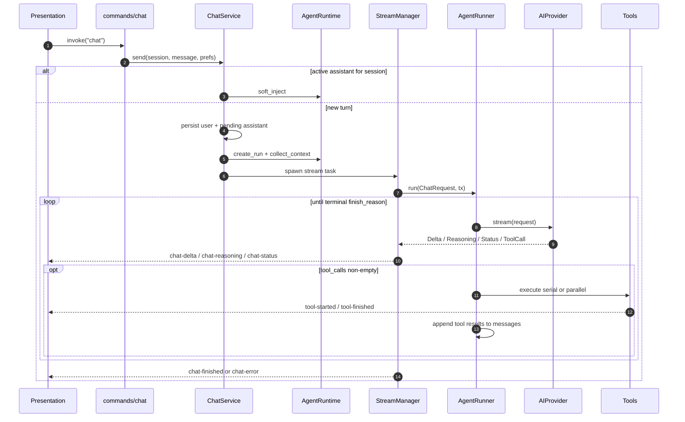
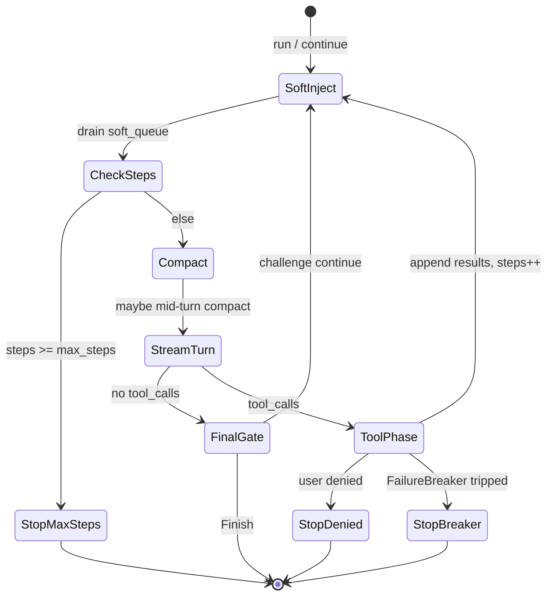

# AAAi Architecture Overview

This document describes the logical structure, dependency rules, control flow, and
orchestration of AAAi. It is intended for contributors who need to locate code
paths and reason about change impact.

<p>
  <a href="./architecture-overview.md">English</a> ·
  <a href="./architecture-overview.zh-CN.md">简体中文</a>
</p>

|             |                                     |
| ----------- | ----------------------------------- |
| **Product** | AAAi — Windows desktop AI assistant |
| **Runtime** | Tauri 2 (WebView2 + Rust)           |
| **UI**      | Vue 3 · Vite · Pinia · TypeScript   |
| **Domain**  | Rust (`src-tauri/src`)              |

---

## 1. Scope

**In scope**

- Process / window topology
- Layered module boundaries and allowed dependencies
- Primary chat request path (UI → domain → provider → tools → UI events)
- Agent turn orchestration and policy hooks

**Out of scope**

- Provider-specific HTTP schemas
- Individual tool argument contracts
- UI visual design

---

## 2. System context

AAAi runs as a single native process hosting multiple WebView windows. The Rust
host owns OS integration; the WebView owns presentation and local UI state.



| Actor / system      | Interaction                                                       |
| ------------------- | ----------------------------------------------------------------- |
| User                | Global hotkey, tray, composer, review UI                          |
| IDE plugins         | Best-effort local context push (file, workspace, selection)       |
| Microsoft Office    | COM for document context and `word_*` / `excel_*` / `ppt_*` tools |
| Model providers     | Authenticated HTTPS; streaming where supported                    |
| MCP / search / mem0 | Optional; enabled explicitly in settings                          |

---

## 3. Logical architecture

### 3.1 Layers

Dependencies point **downward only**. Cross-layer calls that skip a boundary
(e.g. Vue store → raw Tauri API, `commands/` → provider HTTP) are treated as
bugs.



| Layer           | Location                                            | Responsibility                                   | Must not                        |
| --------------- | --------------------------------------------------- | ------------------------------------------------ | ------------------------------- |
| L1 Presentation | `src/{layouts,components,composables,stores,pages}` | Render, local UX state, RAF-batched stream merge | Call providers or execute tools |
| L2 Bridge       | `src/services/ipc`, `commands/`, `adapters/`        | Serialize IPC DTOs; map `BusEvent` → Tauri emits | Own business policy             |
| L3 Domain       | `core/{chat,ai,tools,agent,context,…}`              | Chat lifecycle, agent loop, tools, prompts       | Depend on Vue / DOM             |
| L4 Adapters     | `runtime/`, `services/`, `core/{office,mcp,lsp}`    | OS, COM, HTTP clients, MCP transport             | Drive the agent loop            |

### 3.2 Frontend dependency rule

```text
UI → composables → stores → services → services/ipc → Tauri
                 ↘ services ↗
```

`stores` and `services` must not import `components` / `layouts` / `pages`.

### 3.3 Backend dependency rule

```text
lib / main
  → commands (IPC façade)
  → core::* (domain)
  → runtime / office / mcp (adapters)
services (window, hotkey, settings) → core where needed
```

`commands/*` validate input and delegate; orchestration lives in `ChatService`
and `AgentRuntime`, not in command handlers.

---

## 4. Deployment / process view

One OS process, multiple WebView labels. Domain state is shared in-process.



| Surface   | Label               | Role                                            |
| --------- | ------------------- | ----------------------------------------------- |
| Workbench | `workbench`         | Full session management, review, settings embed |
| Overlay   | `overlay*`          | Floating composer; Quick Ask or workspace-bound |
| Settings  | `settings`          | Provider / agent / extension configuration      |
| Preview   | `overlay-preview-*` | Image preview windows                           |

Session identity (`session_id`) is owned by the Rust conversation store. Overlay
and Workbench may attach to the **same** session concurrently.

---

## 5. Component catalog (domain)

| Component         | Path                                       | Role                                                                       |
| ----------------- | ------------------------------------------ | -------------------------------------------------------------------------- |
| `ChatService`     | `core/chat/service.rs`                     | Entry: persist messages, resolve context/model, start or soft-inject a run |
| `StreamManager`   | `core/chat/stream.rs`                      | Background task, cancel, stream aggregation, emit UI events                |
| `AgentRunner`     | `core/chat/agent.rs`                       | **Primary** model↔tools loop                                               |
| `agent_loop::*`   | `core/chat/agent_loop/`                    | Turn policies: stream collect, tools, challenge, compact, failure breaker  |
| `AgentRuntime`    | `core/agent/runtime/`                      | Run state machine, cancel, soft-inject queue, debug snapshots              |
| `AIProvider`      | `core/ai/`                                 | Streaming / non-streaming model adapters                                   |
| `ToolRegistry`    | `core/tools/`                              | Schema exposure, approval, path permission, execution                      |
| `ContextResolver` | `core/context/`                            | Environment, selection, IDE, Explorer context                              |
| `EventBus`        | `core/event/` + `adapters/tauri_events.rs` | Domain → frontend event projection                                         |

### Naming: three “runtime” modules

| Path                  | Meaning                                                           |
| --------------------- | ----------------------------------------------------------------- |
| `core/runtime/`       | Chat protocol types (`ChatMessage`, `StreamEvent`, `ChatRequest`) |
| `crate::runtime/`     | Pluggable tool adapters (git, search, browser, …)                 |
| `core/agent/runtime/` | Agent **run lifecycle** shell                                     |

### AgentRunner vs AgentRuntime

|                     | AgentRunner                                 | AgentRuntime                                                        |
| ------------------- | ------------------------------------------- | ------------------------------------------------------------------- |
| Question it answers | “What does the model do next?”              | “Is this run active / cancelled / injectible?”                      |
| Owns                | Stream turns, tool batches, completion gate | Run id, epoch, soft-inject queue, event bridge                      |
| Call direction      | Invoked by `StreamManager`                  | Creates run; delegates streaming to `StreamManager` → `AgentRunner` |

Planner / executor under `core/agent/` support run-level plan steps and a tool
façade. They are **not** a second chat agent loop.

---

## 6. Control flow — chat send

### 6.1 Happy path



Mid-turn follow-up takes the `soft_inject` branch and does not create a new assistant bubble.

### 6.2 Frontend projection

```text
Tauri emit
  → src/main.ts listeners
  → createRafBatch (delta/reasoning only)
  → chatStore.applyStreamDeltas | finishMessage | failMessage | setActivityStatus
  → MessageList / activity indicator
```

Transport errors that are retried inside the provider emit
`chat-status` with `kind = stream_retry:{attempt}:{max}` before a new attempt.
The store clears partial assistant content for that message so tokens are not
duplicated.

### 6.3 Call stack (reference)

```text
commands/chat.rs::chat
  → ChatService::send
      → AgentRuntime::{create_run, collect_context} | soft_inject
      → StreamManager::spawn
          → AgentRunner::run
              → agent_loop::collect_stream_turn
              → AIProvider::stream
              → agent_loop::tools::{execute_serial, execute_parallel}
              → agent_loop::{challenge, mid_turn_compact, soft_inject, failure}
```

---

## 7. Orchestration — AgentRunner loop

`AgentRunner::run` is the single orchestration spine for chat, eval, and
sub-agents. Policy modules in `agent_loop/` plug into that spine.



| Module             | Concern                                                                           |
| ------------------ | --------------------------------------------------------------------------------- |
| `stream_turn`      | Fold one provider stream into content / reasoning / tool_calls; forward UI events |
| `tools`            | Serial vs parallel dispatch; tool activity events                                 |
| `challenge`        | Empty-completion / verification gate before accepting a final answer              |
| `mid_turn_compact` | Context-window pressure compaction                                                |
| `soft_inject`      | Merge queued user follow-ups at a safe boundary                                   |
| `failure`          | Consecutive / identical tool-error circuit breaker                                |

**Ask vs Agent** is enforced at tool schema exposure and approval policy (settings),
not by a separate runner. Ask mode withholds write / shell / git capabilities;
Agent mode enables them subject to approval mode (e.g. always allow, ask each time).

---

## 8. Event contract (domain → UI)

Events are defined in `core/event::BusEvent` and projected by
`adapters/tauri_events.rs`. Primary chat surface events:

| BusEvent        | Tauri event                      | Consumer effect                       |
| --------------- | -------------------------------- | ------------------------------------- |
| `ChatStarted`   | `chat-started`                   | Insert user + pending assistant       |
| `ChatDelta`     | `chat-delta`                     | Append content (RAF-batched)          |
| `ChatReasoning` | `chat-reasoning`                 | Append reasoning                      |
| `ChatStatus`    | `chat-status`                    | Activity label / `stream_retry` reset |
| `ChatFinished`  | `chat-finished`                  | Replace content, mark done            |
| `ChatError`     | `chat-error`                     | Mark error, surface message           |
| Tool activity   | `tool-started` / `tool-finished` | Upsert tool cards                     |

Command results (`ChatSendResponse`) return ids only; streaming content is
event-driven.

---

## 9. Extension points

| Goal                    | Preferred hook                                          |
| ----------------------- | ------------------------------------------------------- |
| New model vendor        | `core/ai` `AIProvider` impl + settings wiring           |
| New built-in tool       | `core/tools` registry + optional `runtime/` adapter     |
| New turn policy         | `core/chat/agent_loop` module called from `AgentRunner` |
| New window surface      | Tauri window label + `src/main.ts` bootstrap branch     |
| External context source | `core/context` provider                                 |

Avoid introducing a parallel agent loop beside `AgentRunner`.

---

## 10. Related source entry points

| Concern                       | Start here                                               |
| ----------------------------- | -------------------------------------------------------- |
| App bootstrap / tray / hotkey | `src-tauri/src/lib.rs`                                   |
| Chat IPC                      | `commands/chat.rs`                                       |
| Send + context assembly       | `core/chat/service.rs`                                   |
| Stream lifecycle              | `core/chat/stream.rs`                                    |
| Agent loop                    | `core/chat/agent.rs`, `core/chat/agent_loop/`            |
| Run shell                     | `core/agent/runtime/`                                    |
| Frontend IPC + stream batch   | `src/services/ipc/`, `src/main.ts`, `src/stores/chat.ts` |
