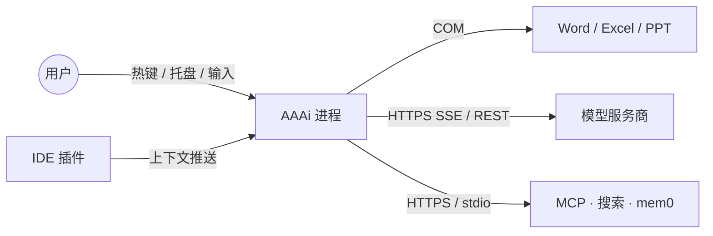
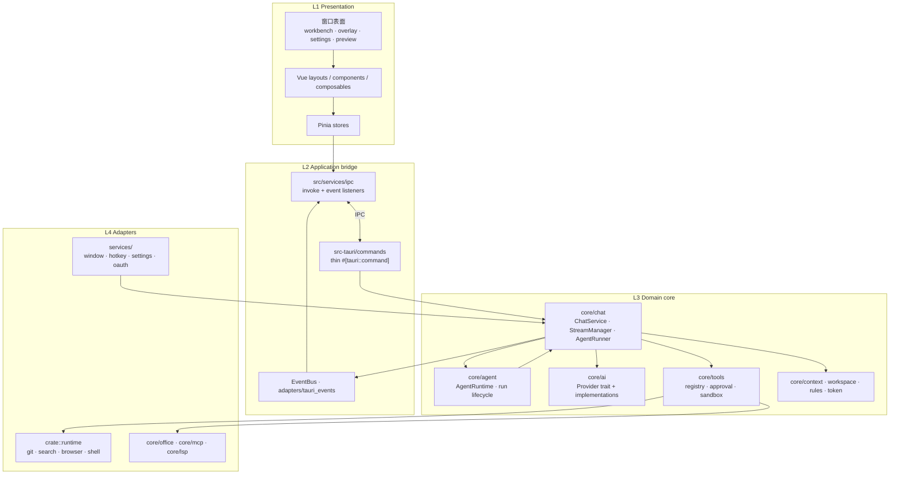
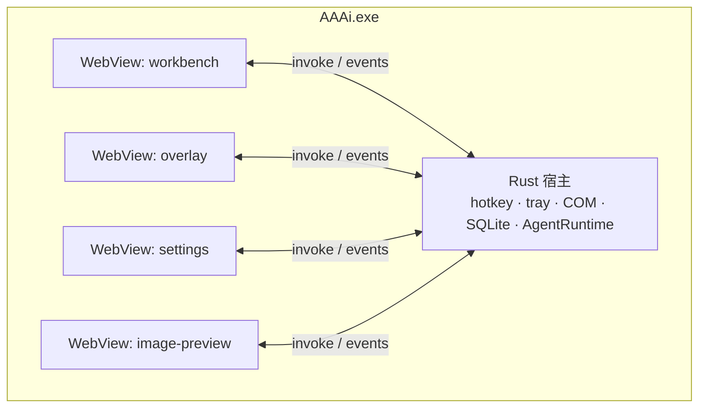
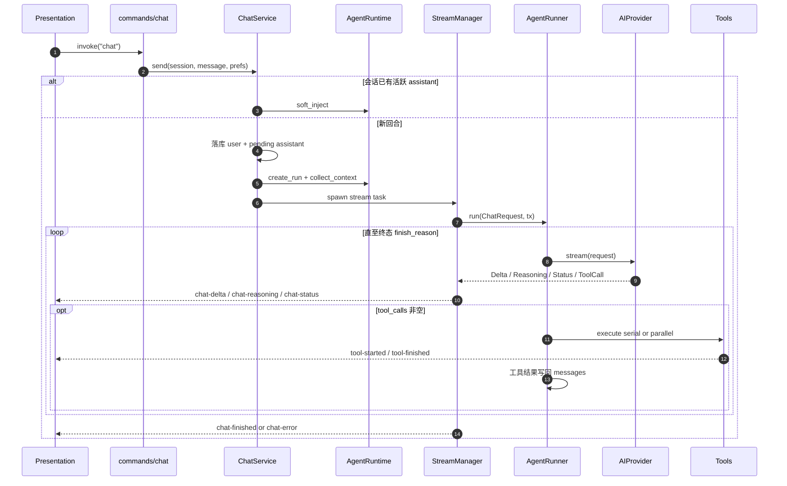
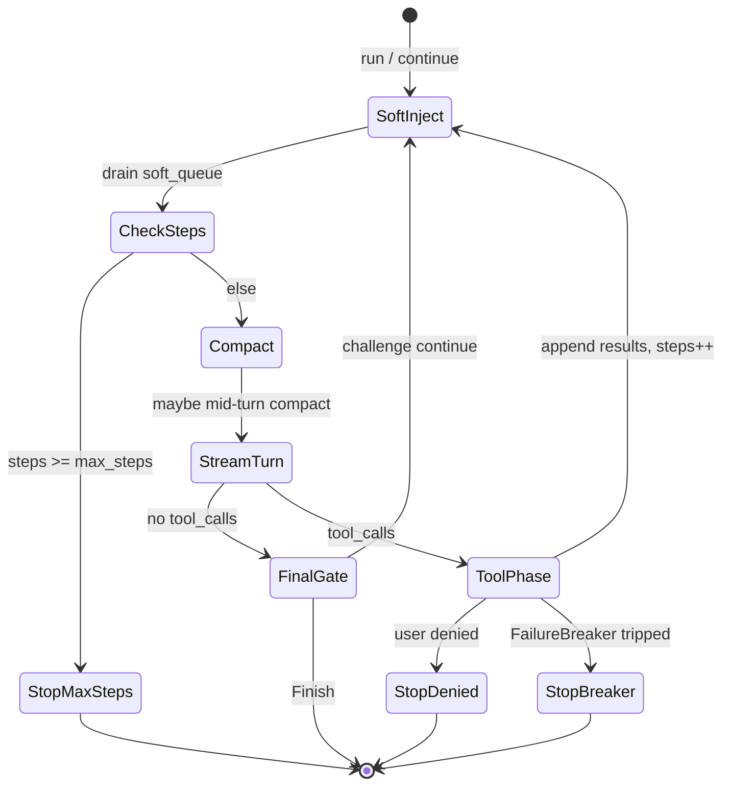

# AAAi 技术架构总览

本文描述 AAAi 的逻辑结构、依赖约束、控制流与编排，面向需要定位代码路径、评估变更影响的贡献者。

<p>
  <a href="./architecture-overview.md">English</a> ·
  <a href="./architecture-overview.zh-CN.md">简体中文</a>
</p>

|            |                                   |
| ---------- | --------------------------------- |
| **产品**   | AAAi — Windows 桌面 AI 助手       |
| **运行时** | Tauri 2（WebView2 + Rust）        |
| **界面**   | Vue 3 · Vite · Pinia · TypeScript |
| **领域**   | Rust（`src-tauri/src`）           |

---

## 1. 范围

**范围内**

- 进程 / 窗口拓扑
- 分层边界与允许的依赖方向
- 主聊天请求路径（UI → 领域 → Provider → 工具 → UI 事件）
- Agent 回合编排与策略钩子

**范围外**

- 各 Provider 的 HTTP 协议细节
- 单个工具的参数契约
- UI 视觉设计

---

## 2. 系统上下文

AAAi 以**单个原生进程**托管多个 WebView 窗口。Rust 宿主负责 OS 集成；WebView 负责呈现与本地 UI 状态。



| 参与方            | 交互方式                                              |
| ----------------- | ----------------------------------------------------- |
| 用户              | 全局热键、托盘、输入栏、Diff 审查                     |
| IDE 插件          | 尽力而为的本地上下文推送（文件、工作区、选区）        |
| Microsoft Office  | COM：文档上下文与 `word_*` / `excel_*` / `ppt_*` 工具 |
| 模型服务商        | 鉴权 HTTPS；支持处使用流式                            |
| MCP / 搜索 / mem0 | 可选；在设置中显式启用                                |

---

## 3. 逻辑架构

### 3.1 分层

依赖**只允许向下**。跨层越界调用（例如 Vue store 直连 Tauri API、`commands/` 直接发 Provider HTTP）视为缺陷。



| 层              | 位置                                                | 职责                                            | 禁止                     |
| --------------- | --------------------------------------------------- | ----------------------------------------------- | ------------------------ |
| L1 Presentation | `src/{layouts,components,composables,stores,pages}` | 渲染、本地 UX 状态、RAF 合并流式增量            | 调用 Provider 或执行工具 |
| L2 Bridge       | `src/services/ipc`、`commands/`、`adapters/`        | 序列化 IPC DTO；将 `BusEvent` 投影为 Tauri emit | 承载业务策略             |
| L3 Domain       | `core/{chat,ai,tools,agent,context,…}`              | 聊天生命周期、Agent 循环、工具、提示词          | 依赖 Vue / DOM           |
| L4 Adapters     | `runtime/`、`services/`、`core/{office,mcp,lsp}`    | OS、COM、HTTP 客户端、MCP 传输                  | 驱动 Agent 主循环        |

### 3.2 前端依赖规则

```text
UI → composables → stores → services → services/ipc → Tauri
                 ↘ services ↗
```

`stores` 与 `services` 不得 import `components` / `layouts` / `pages`。

### 3.3 后端依赖规则

```text
lib / main
  → commands（IPC 门面）
  → core::*（领域）
  → runtime / office / mcp（适配）
services（window、hotkey、settings）→ 按需依赖 core
```

`commands/*` 只做入参校验与转发；编排归属 `ChatService` 与 `AgentRuntime`，不写在 command handler 里。

---

## 4. 部署 / 进程视图

一个 OS 进程，多个 WebView label。领域状态在进程内共享。



| 表面      | Label               | 职责                               |
| --------- | ------------------- | ---------------------------------- |
| Workbench | `workbench`         | 完整会话管理、审查、内嵌设置       |
| Overlay   | `overlay*`          | 悬浮输入；临时快速提问或绑定工作区 |
| Settings  | `settings`          | 服务商 / Agent / 扩展配置          |
| Preview   | `overlay-preview-*` | 图片预览窗口                       |

会话标识（`session_id`）由 Rust 会话存储拥有。Overlay 与 Workbench 可同时附着到**同一**会话。

---

## 5. 领域组件目录

| 组件              | 路径                                       | 职责                                                         |
| ----------------- | ------------------------------------------ | ------------------------------------------------------------ |
| `ChatService`     | `core/chat/service.rs`                     | 入口：落库消息、解析上下文/模型、启动或 soft-inject 一轮 run |
| `StreamManager`   | `core/chat/stream.rs`                      | 后台任务、取消、流式聚合、向外发 UI 事件                     |
| `AgentRunner`     | `core/chat/agent.rs`                       | **主** model↔tools 循环                                      |
| `agent_loop::*`   | `core/chat/agent_loop/`                    | 回合策略：收流、工具、challenge、压缩、失败熔断              |
| `AgentRuntime`    | `core/agent/runtime/`                      | Run 状态机、取消、soft-inject 队列、debug 快照               |
| `AIProvider`      | `core/ai/`                                 | 流式 / 非流式模型适配                                        |
| `ToolRegistry`    | `core/tools/`                              | Schema 暴露、审批、路径权限、执行                            |
| `ContextResolver` | `core/context/`                            | 环境、选区、IDE、资源管理器上下文                            |
| `EventBus`        | `core/event/` + `adapters/tauri_events.rs` | 领域 → 前端事件投影                                          |

### 命名：三处 “runtime”

| 路径                  | 含义                                                        |
| --------------------- | ----------------------------------------------------------- |
| `core/runtime/`       | 聊天协议类型（`ChatMessage`、`StreamEvent`、`ChatRequest`） |
| `crate::runtime/`     | 可插拔工具适配（git、search、browser 等）                   |
| `core/agent/runtime/` | Agent **run 生命周期**壳                                    |

### AgentRunner 与 AgentRuntime

|            | AgentRunner                  | AgentRuntime                                               |
| ---------- | ---------------------------- | ---------------------------------------------------------- |
| 回答的问题 | 「模型下一步做什么？」       | 「本轮 run 是否活跃 / 已取消 / 可注入？」                  |
| 拥有       | 流式回合、工具批次、完成门禁 | Run id、epoch、soft-inject 队列、事件桥                    |
| 调用方向   | 由 `StreamManager` 调用      | 创建 run；将流式工作委托给 `StreamManager` → `AgentRunner` |

`core/agent/` 下的 Planner / Executor 服务于 run 级计划步骤与工具门面，**不是**第二套对话 Agent 循环。

---

## 6. 控制流 — 发送消息

### 6.1 主路径



回合中追问走 `soft_inject` 分支，不会新建 assistant 气泡。

### 6.2 前端投影

```text
Tauri emit
  → src/main.ts 监听
  → createRafBatch（仅 delta / reasoning）
  → chatStore.applyStreamDeltas | finishMessage | failMessage | setActivityStatus
  → MessageList / 活动指示器
```

Provider 内可重试的传输错误会在再次尝试前发出 `chat-status`，
`kind = stream_retry:{attempt}:{max}`。Store 清空该消息的半截 assistant 内容，避免 token 重复拼接。

### 6.3 调用栈（检索用）

```text
commands/chat.rs::chat
  → ChatService::send
      → AgentRuntime::{create_run, collect_context} | soft_inject
      → StreamManager::spawn
          → AgentRunner::run
              → agent_loop::collect_stream_turn
              → AIProvider::stream
              → agent_loop::tools::{execute_serial, execute_parallel}
              → agent_loop::{challenge, mid_turn_compact, soft_inject, failure}
```

---

## 7. 编排 — AgentRunner 循环

`AgentRunner::run` 是聊天、eval 与子 Agent 的**唯一**编排主轴。`agent_loop/` 中的策略模块挂接在该主轴上。



| 模块               | 关注点                                                                    |
| ------------------ | ------------------------------------------------------------------------- |
| `stream_turn`      | 将一轮 Provider 流折叠为 content / reasoning / tool_calls，并转发 UI 事件 |
| `tools`            | 串行 / 并行调度；工具 activity 事件                                       |
| `challenge`        | 空完成 / 校验门禁；必要时再开一轮                                         |
| `mid_turn_compact` | 上下文窗口压力下的压缩                                                    |
| `soft_inject`      | 在安全边界合并排队中的用户追问                                            |
| `failure`          | 连续失败 / 同错重复的熔断                                                 |

**Ask 与 Agent** 通过工具 Schema 暴露与审批策略（设置）约束，而不是单独的 Runner。Ask 不开放写文件 / Shell / Git；Agent 在审批模式（如一律允许、每次询问）下开放。

---

## 8. 事件契约（领域 → UI）

事件定义于 `core/event::BusEvent`，由 `adapters/tauri_events.rs` 投影。聊天主表面事件：

| BusEvent        | Tauri 事件                       | 消费效果                       |
| --------------- | -------------------------------- | ------------------------------ |
| `ChatStarted`   | `chat-started`                   | 插入 user + pending assistant  |
| `ChatDelta`     | `chat-delta`                     | 追加正文（RAF 批处理）         |
| `ChatReasoning` | `chat-reasoning`                 | 追加思考                       |
| `ChatStatus`    | `chat-status`                    | 活动标签 / `stream_retry` 重置 |
| `ChatFinished`  | `chat-finished`                  | 用最终内容替换，标记完成       |
| `ChatError`     | `chat-error`                     | 标记错误并展示文案             |
| 工具活动        | `tool-started` / `tool-finished` | Upsert 工具卡片                |

`ChatSendResponse` 仅返回 id；流式正文走事件通道。

---

## 9. 扩展点

| 目标         | 首选挂接点                                         |
| ------------ | -------------------------------------------------- |
| 新模型厂商   | `core/ai` 实现 `AIProvider` + 设置接线             |
| 新内置工具   | `core/tools` 注册表 + 可选 `runtime/` 适配         |
| 新回合策略   | `core/chat/agent_loop` 模块，由 `AgentRunner` 调用 |
| 新窗口表面   | Tauri window label + `src/main.ts` 启动分支        |
| 外部上下文源 | `core/context` provider                            |

避免在 `AgentRunner` 之外平行再造一套 Agent 循环。

---

## 10. 相关源码入口

| 关注点                 | 从此处开始                                               |
| ---------------------- | -------------------------------------------------------- |
| 应用启动 / 托盘 / 热键 | `src-tauri/src/lib.rs`                                   |
| 聊天 IPC               | `commands/chat.rs`                                       |
| 发送与上下文组装       | `core/chat/service.rs`                                   |
| 流式生命周期           | `core/chat/stream.rs`                                    |
| Agent 循环             | `core/chat/agent.rs`、`core/chat/agent_loop/`            |
| Run 壳                 | `core/agent/runtime/`                                    |
| 前端 IPC 与流式批处理  | `src/services/ipc/`、`src/main.ts`、`src/stores/chat.ts` |
